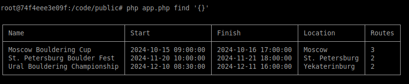

# PHP_2024

Irina Yurtaeva PHP-24
In this HW I created a simple console application that shows the collaboration of several database patterns: LazyLoad, IdentityMap, DataMapper. But I still do not get how to use Unit of Work.

```shell
docker exec -it otus-php--php bash

```
```shell
php app.php find '{}';
```

https://otus.ru/lessons/razrabotchik-php/?utm_source=github&utm_medium=free&utm_campaign=otus
