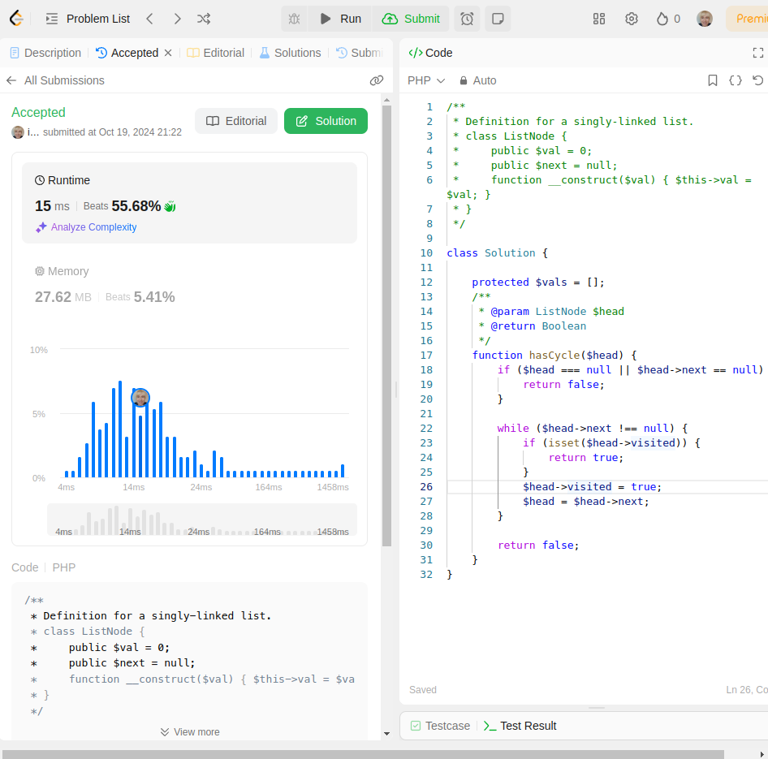
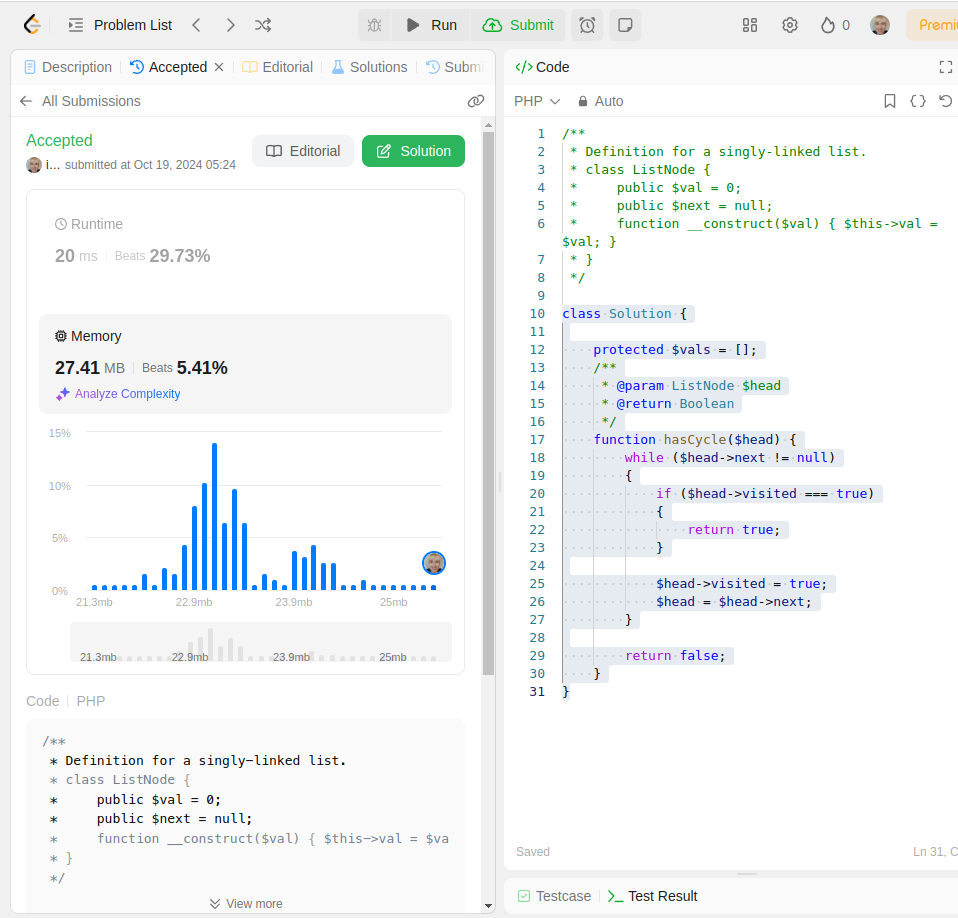
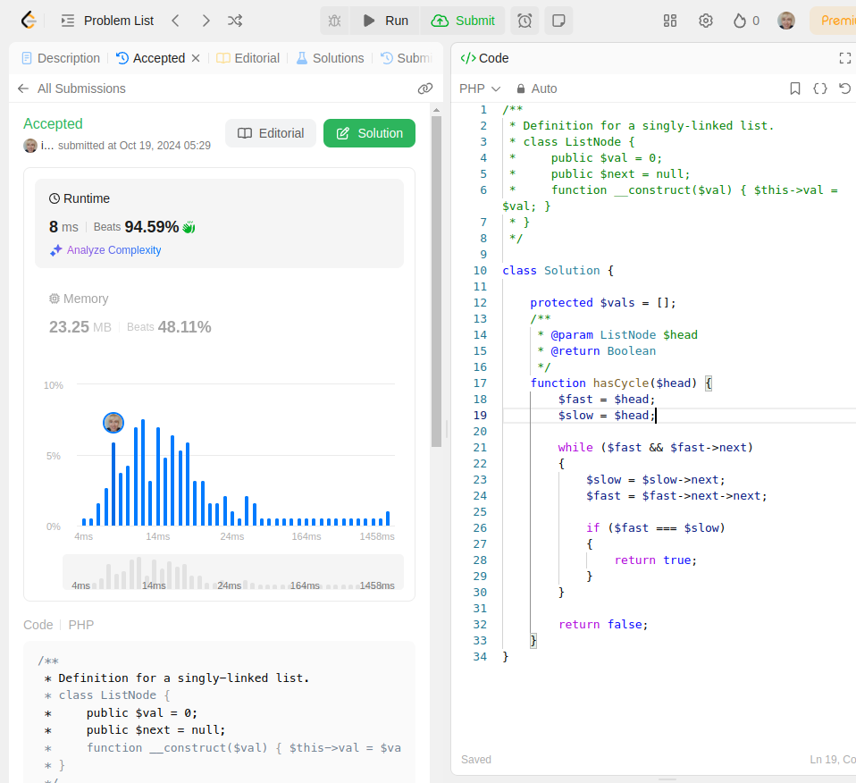
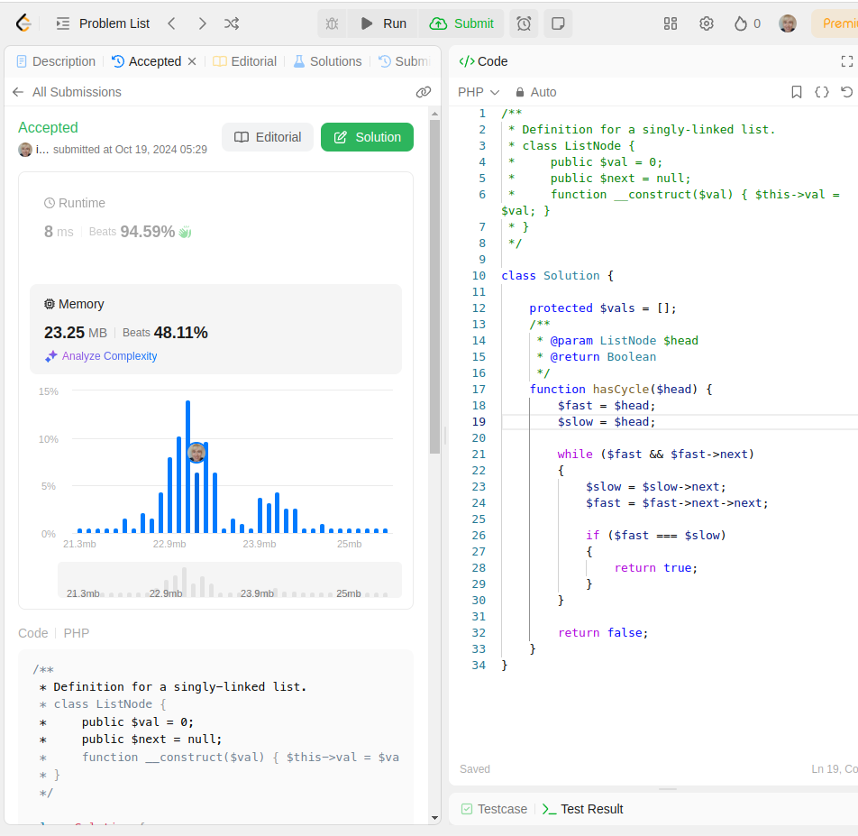
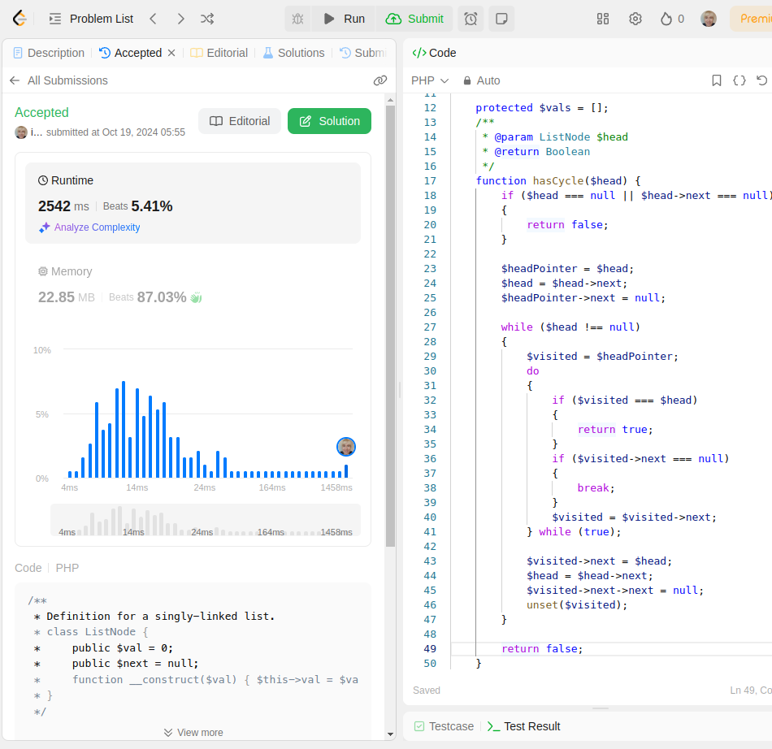
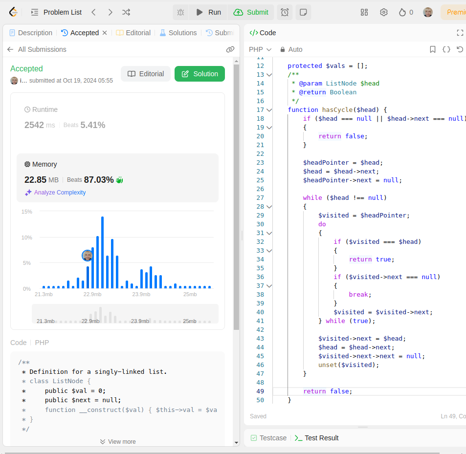
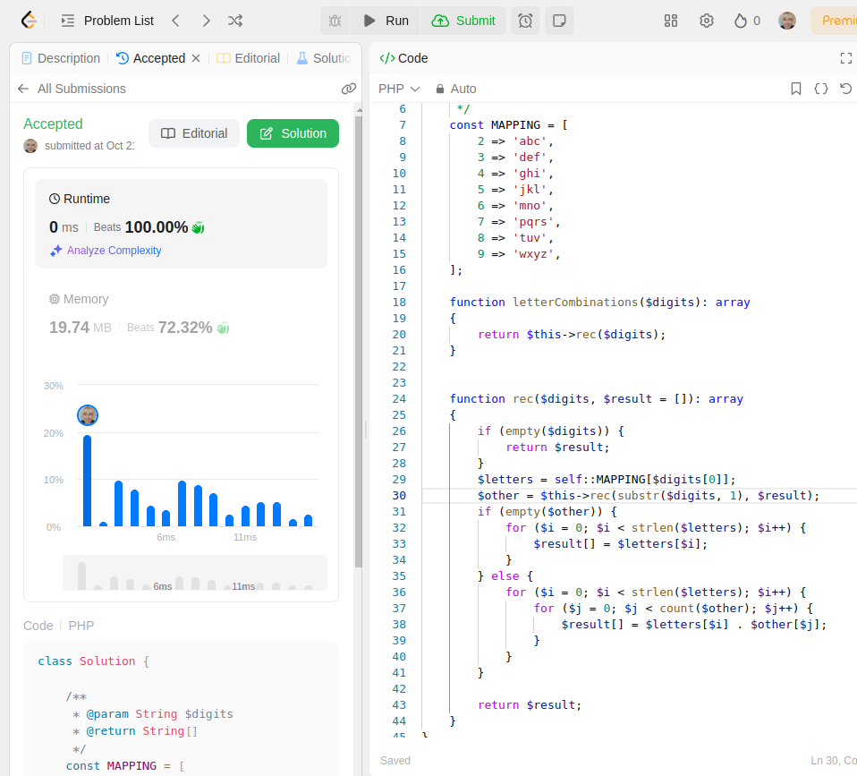
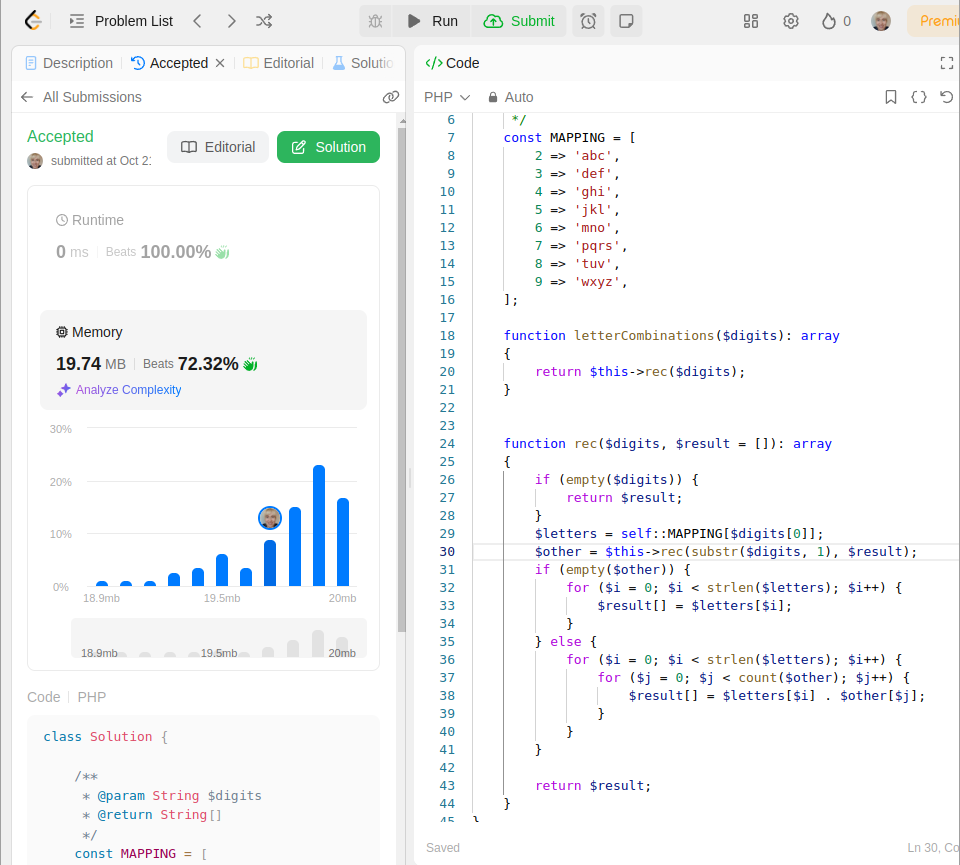

# PHP_2024

Irina Yurtaeva PHP-24

There are some pictures from leetcode.com with tasks and solutions.
## 141. Linked List Cycle
### Rude solution: 
    Complexity: O(n)
    Memory: O(n)

### Stolen solution:
    Complexity: O(n)
    Memory: O(1)

### Straight solution:
    Complexity: O(n*n)
    Memory: O(1)

## 17. Letter Combinations of a Phone Number
### Just a solution:
    Complexity: O(n*m)
    Memory: O(n)

https://otus.ru/lessons/razrabotchik-php/?utm_source=github&utm_medium=free&utm_campaign=otus
