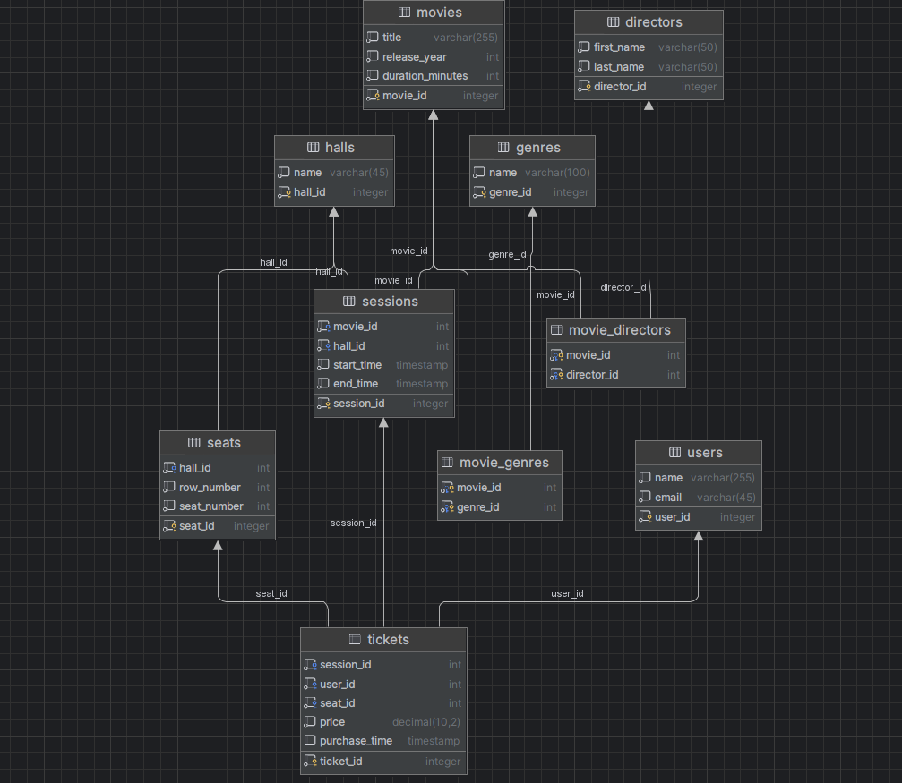

# PHP_2024

https://otus.ru/lessons/razrabotchik-php/?utm_source=github&utm_medium=free&utm_campaign=otus

## Информация по ДЗ

### Диаграмма

<picture>
 
</picture>

### Запуск

Переименовать `.env.example` в `.env`. При необходимости изменить значения переменных.

Инициализация docker контейнера с СУБД и вывод информации о самом прибыльном фильме в консоль:
```sh
make init
```
