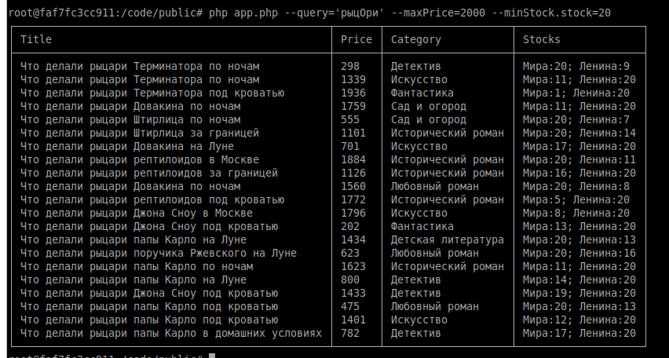

# PHP_2024

Irina Yurtaeva PHP-24

# Запрос в Elasticsearch
Пользователь ищет все исторические романы дешевле 2000 рублей (и в наличии) по поисковому запросу "рыцОри"
``docker exec -it otus-php--php php app.php --query='рыцОри' --maxPrice=2000 --minStock.stock=1``
в результате должны вернуться товары, ранжированные по релевантности
домашку нужно сдать как консольное PHP-приложение, которое принимает один или несколько параметров командной строки и выводит результат в виде текстовой таблички, после чего завершает работу

Результатом выполнения команды: 
``docker exec -it otus-php--php php app.php  --query='рыцОри' --maxPrice=2000 --minStock.stock=20``

https://otus.ru/lessons/razrabotchik-php/?utm_source=github&utm_medium=free&utm_campaign=otus
