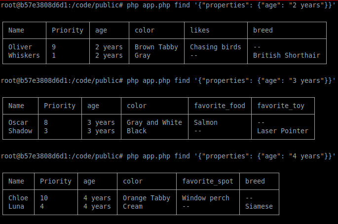

# PHP_2024

Irina Yurtaeva PHP-24

```shell
docker exec -it otus-php--php bash
```
```shell
php app.php save '{"priority":11,"name":"First player","properties":{"game":"Baseball","team":"Yankees"}}';
php app.php savelist '[{"priority":1,"name":"Whiskers","properties":{"age":"2 years","color":"Gray","breed":"British Shorthair"}},{"priority":2,"name":"Mittens","properties":{"age":"1 year","color":"Black and White","breed":"Tuxedo"}},{"priority":3,"name":"Shadow","properties":{"age":"3 years","color":"Black","favorite_toy":"Laser Pointer"}},{"priority":4,"name":"Luna","properties":{"age":"4 years","color":"Cream","breed":"Siamese"}},{"priority":5,"name":"Simba","properties":{"age":"5 years","color":"Orange","breed":"Maine Coon"}},{"priority":6,"name":"Cleo","properties":{"age":"5 years","color":"Brown","hobby":"Climbing trees"}},{"priority":7,"name":"Bella","properties":{"age":"6 years","color":"White","special_skill":"Catching mice"}},{"priority":8,"name":"Oscar","properties":{"age":"3 years","color":"Gray and White","favorite_food":"Salmon"}},{"priority":9,"name":"Oliver","properties":{"age":"2 years","color":"Brown Tabby","likes":"Chasing birds"}},{"priority":10,"name":"Chloe","properties":{"age":"4 years","color":"Orange Tabby","favorite_spot":"Window perch"}}]';
```
```shell
php app.php find '{"priority": 10, "age": 2}';
```


```shell
php app.php purge;
```
https://otus.ru/lessons/razrabotchik-php/?utm_source=github&utm_medium=free&utm_campaign=otus
