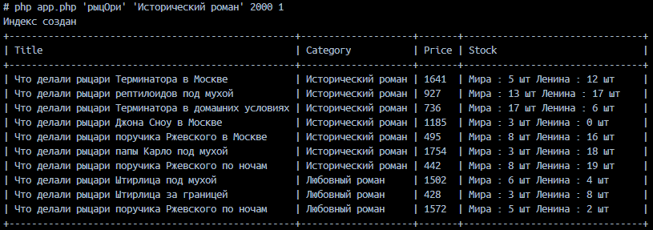

# PHP_2024

Пользователь ищет все исторические романы дешевле 2000 рублей (и в наличии) по поисковому запросу "рыцОри"

Для этого нужно запустить ``docker-compose up`` и дождаться, когда в контейнере ``elastic`` закончится загрузка,
затем в контейнере ``php-fpm`` выполнить:

``php app.php 'рыцОри' 'Исторический роман' 2000 1``

