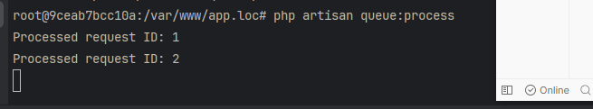
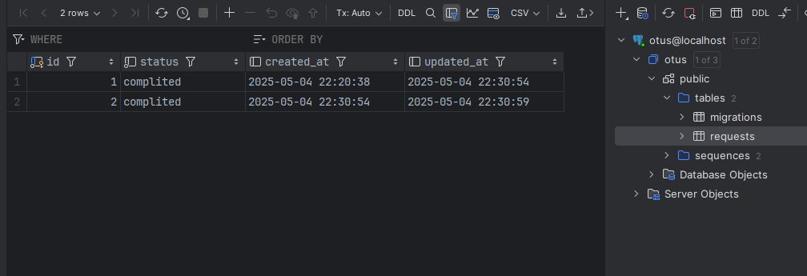
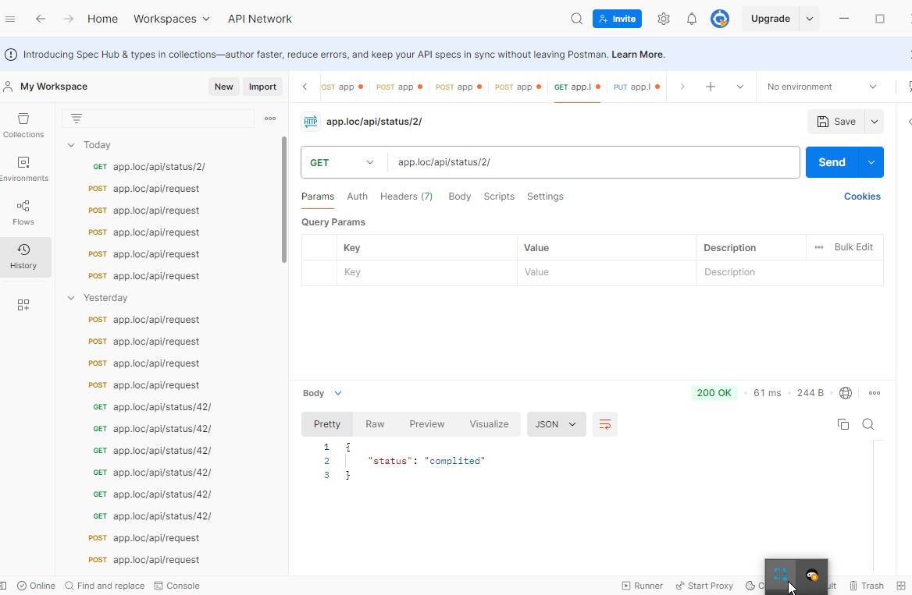
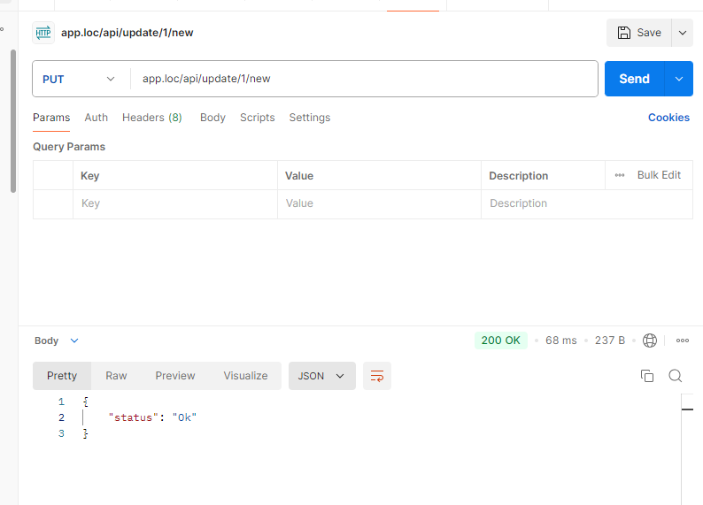

# PHP_2024

https://otus.ru/lessons/razrabotchik-php/?utm_source=github&utm_medium=free&utm_campaign=otus

docker-compose up --build -d
docker compose exec -it app bash
composer install
php artisan migrate

### Для того чтобы очереди начали обрабатываться, необходимо запустить процесс, используя следующую команду:
```
php artisan queue:process   
```

[Ссылка на документацию API](./code/storage/api-docs/api-docs.json)


### Тестирование API
Создание запроса POST







Создание запроса GET


Создание запроса PUT 
